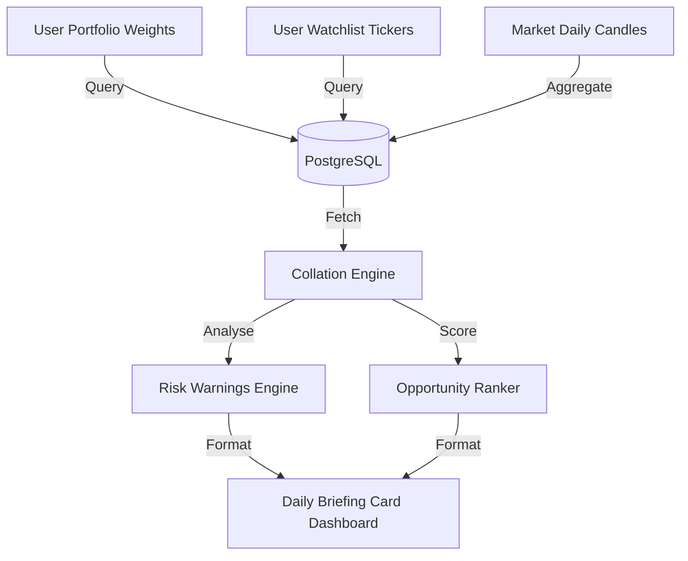

# StockStory — Daily Briefing System Report

This report outlines the technical architecture, content blocks, and intelligence collation rules of the **Daily Investor Brief** suite.

---

## 1. Content Composition

The Daily Brief aggregates market parameters and user portfolio data into a single, high-signal dashboard summary:

* **Portfolio Changes**: Summarizes overnight price changes, capital adjustments, and performance metrics across holdings.
* **Watchlist Movements**: Highlights price breakouts, volume spikes, and moving average crossings for stocks on user watchlists.
* **Market Mood**: Displays the macro sentiment regime (Bullish / Neutral / Bearish) derived from index moving averages.
* **Sector Leaders**: Lists the top-performing sectors and factors driving capital flows.
* **Risk Warnings**: Alerts users to potential concerns, such as factor score downgrades, high RSI levels, or negative sentiment shifts.
* **Top Opportunities**: Highlights undervalued stocks showing strong momentum indicators.

---

## 2. Intelligence Gathering & Data Flow



---

## 3. Core Brief Structure Example

When generated, a user's daily brief is divided into clear, actionable segments:

```
[System Notification // 09:30 AM IST]
=================================================================================
Daily Briefing: 2 Tickers in Watchlist on the Move
=================================================================================
• Market Mood: Bullish // Breadth: 82% above SMA50
• Sector Rotation Leader: Defense (+2.4% Average Daily Flow)

Portfolio Alerts:
- HDFCBANK: Risk score decreased (Score: 78 -> 72) due to minor Net Interest Margin variance.
- RELIANCE: Stable consolidation (+0.4% overnight).

Top Opportunities:
- HAL: Expanding order book, momentum continues bullish.
- INFY: Technical RSI entering buy range (34/100).
=================================================================================
```
