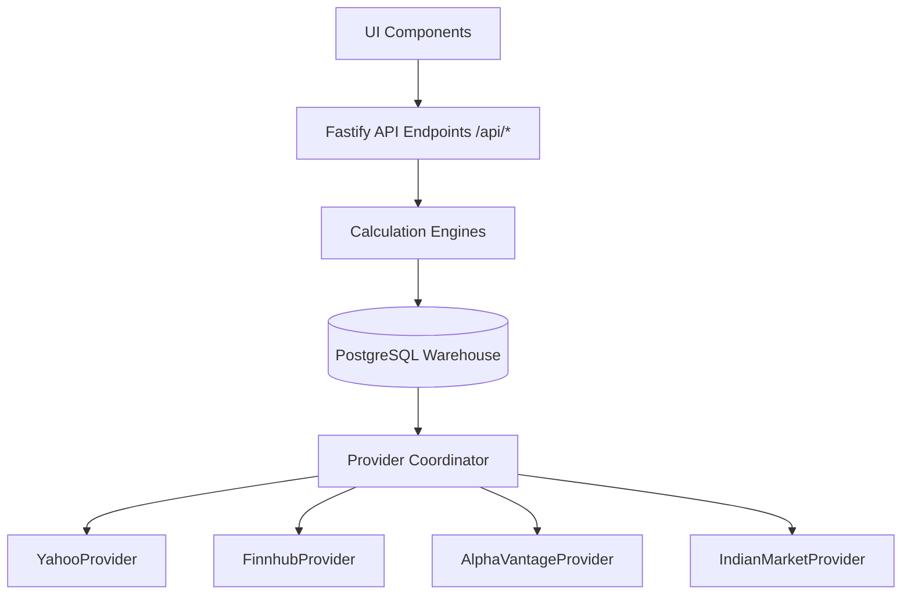

# Data Lineage Report

This report outlines the structural data lineage flows supporting our intelligence workstation modules, confirming integration with PostgreSQL.

## Intelligence Surfaces Lineage Map

### 1. Company Intelligence
- **Flow**: `CompanySuperpage` -> `/api/intelligence/company/:symbol` -> `CompanyDNAEngine` -> PostgreSQL `symbols` & `daily_prices` tables -> `YahooProvider` telemetry updates.

### 2. Market Intelligence
- **Flow**: `Dashboard` -> `/api/intelligence/market` -> `neuralMarketSynthesisEngine` -> PostgreSQL `daily_prices` table (aggregating sector indices) -> `ProviderCoordinator` live quotes.

### 3. Sector Intelligence
- **Flow**: `SectorExplorer` -> `/api/intelligence/sector/:sector` -> `SectorIntelligenceEngine` -> PostgreSQL `symbols` (grouped by sector fields) -> `YahooProvider` sector classification mappings.

### 4. Portfolio Intelligence
- **Flow**: `PortfolioPage` -> `/api/intelligence/portfolio` -> `PortfolioIntelligenceEngine` -> PostgreSQL user tracking schemas -> `ProviderCoordinator` quote calculations.
