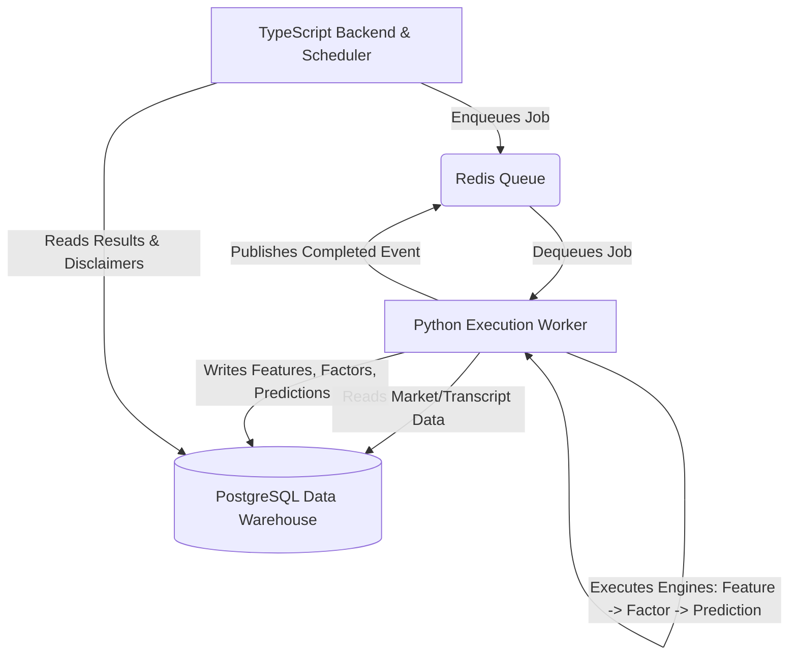
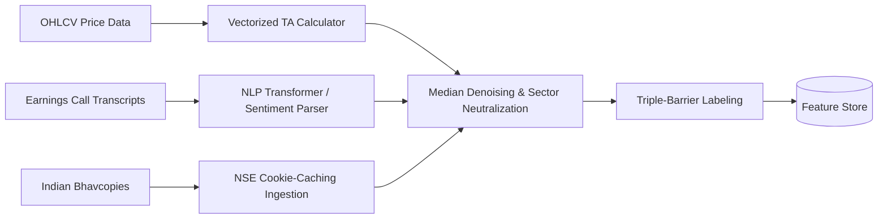
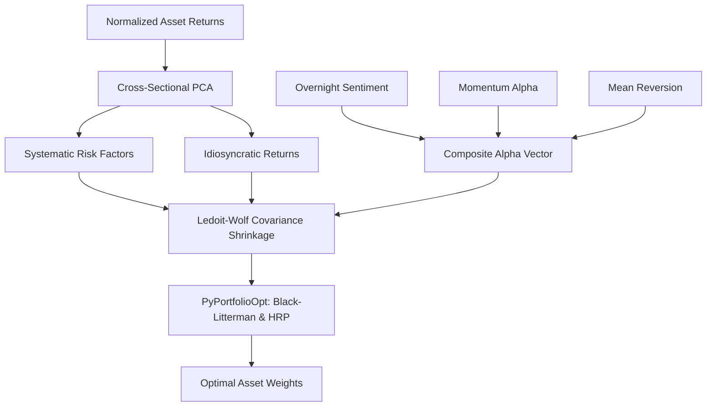
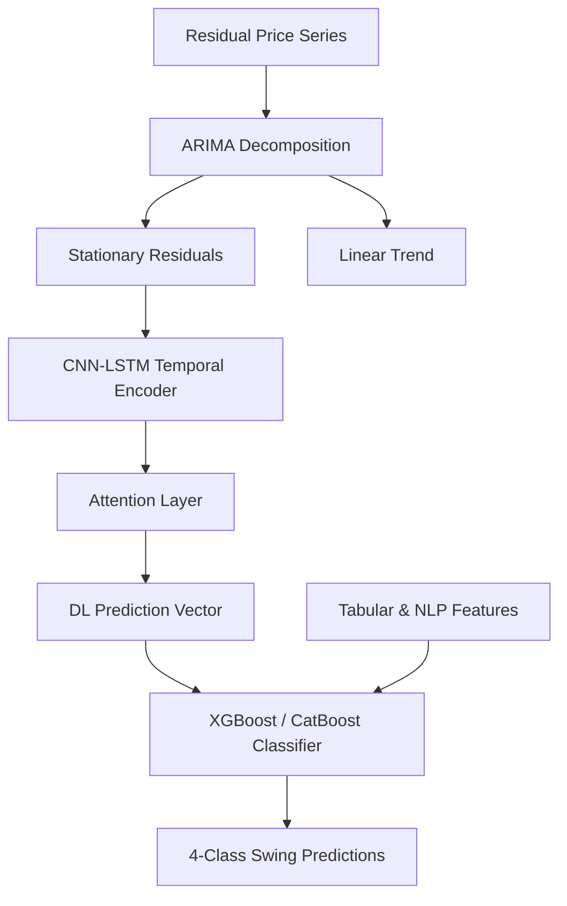

# REPOSITORY AUDIT & UNIFIED ENGINE ARCHITECTURE BLUEPRINT

This document compiles the exhaustive audit of 15 repositories and outlines the production-ready architecture blueprint for **StockStory Feature Engine v1**, **StockStory Factor Engine v1**, and **StockStory Prediction Engine v1**.

---

## Part 1: Repository Audit Report

| Repository Name | Primary Domain | Feature Eng. Quality | Production Readiness | Reusability | License | Target Components Worth Extracting |
| :--- | :--- | :---: | :---: | :---: | :--- | :--- |
| **[ML-stock-prediction-models](https://github.com/kkoooqq/ML-stock-prediction-models.git)** | ML Stock Prediction (LGBM) | High | Medium | Medium | MIT | Median de-noising, sector neutralization, 15-day lookback classification bins. |
| **[Equity-Forecasting-Project](https://github.com/SekaiKana/Equity-Forecasting-Project---Gyoseki-Trading-Competition.git)** | Competition Financial Modeling | Low | Low | Low | Unknown | Traditional competitor benchmarking and cross-sectional adjustments. |
| **[factor_model](https://github.com/keniba/factor_model.git)** | Statistical Risk & Alpha Factors | Very High | High | High | Unknown | Cross-sectional PCA risk model, Close-to-Open Overnight sentiment factor. |
| **[nlp-quant-strat](https://github.com/mateomolinaro1/nlp-quant-strat.git)** | NLP Russell 1000 Strategy | Very High | Very High | High | Unknown | Loughran-McDonald parser, TF-IDF + Sentence Embeddings, Rolling CAPM target builder, Walk-forward CV. |
| **[Technical_Analysis_and_Feature_Engineering](https://github.com/jo-cho/Technical_Analysis_and_Feature_Engineering.git)** | Technical Indicators Matrix | High | Medium | Medium | Unknown | Binary indicators matrix (-1, 0, 1), Triple-Barrier Method labeling, Meta-Labeling. |
| **[Stock.Indicators](https://github.com/DaveSkender/Stock.Indicators.git)** | Mathematical Indicator Library | Very High | Very High | Medium | Apache 2.0 | High-performance smoothing algorithms (Wilder's, Hull), validation of OHLCV inputs. |
| **[finta](https://github.com/peerchemist/finta.git)** | Pandas Technical Indicators | High | High | Very High | LGPL v3 | Vectorized mathematical formulations for 80+ standard TA indicators. |
| **[kallisto](https://github.com/AstraZeneca/kallisto.git)** | Molecular Coordinate Calculations | High | Very High | Low | Apache 2.0 | Configuration validators, strict typing schemas, adjacency/distance matrix math. |
| **[Attention-CLX-stock-prediction](https://github.com/zshicode/Attention-CLX-stock-prediction.git)** | Hybrid Deep Learning (ARIMA/LSTM) | High | Medium | Medium | Unknown | ARIMA residual decomposition, Attention CNN-LSTM architecture. |
| **[FORECASTING-1.0](https://github.com/kennedyCzar/FORECASTING-1.0.git)** | TS Forecasting Models | Medium | Low | Low | Unknown | Basic sequence alignment, data-splitting utilities. |
| **[Fraud-Detaction-with-XGBOOST-and-CATBOOST](https://github.com/arukemre/Fraud-Detaction-with-XGBOOST-and-CATBOOST.git)** | Classification & Imbalance ML | Medium | Medium | Medium | Unknown | CatBoost imbalance configs (`scale_pos_weight`), probability threshold tuning. |
| **[3.0-Financial-Ai-Systems](https://github.com/evelyyyyynnnnn/3.0-Financial-Ai-Systems.git)** | Modular Financial AI Systems | Very High | Medium | High | Unknown | GARCH(1,1) volatility pipeline, macroeconomic features, financial network risk matrices. |
| **[PyPortfolioOpt](https://github.com/PyPortfolio/PyPortfolioOpt.git)** | Portfolio Allocation Optimization | Extremely High | Extremely High | Very High | MIT | Ledoit-Wolf covariance shrinkage, Black-Litterman view injection, Hierarchical Risk Parity (HRP). |
| **[stock-market-india](https://github.com/maanavshah/stock-market-india.git)** | NSE/BSE Scraper | None | Medium | High | MIT | Map of NSE/BSE public HTTP endpoints and request structures. |
| **[jugaad-data](https://github.com/jugaad-py/jugaad-data.git)** | NSE India Data Acquisition | None | High | High | YOLO | Cookies management, active session initialization, Bhavcopy caching logic. |

---

### Detailed Repository Audits

### 1. ML-stock-prediction-models
*   **Feature Engineering Quality**: High. It crafts custom price-volume relations, integrates cash flow signals, and parses K-line candlestick shapes using TA-Lib. Features go through outlier median de-noising, sector neutralization, and standard scaling. Drops highly correlated features and uses LightGBM importance scores to select the top features.
*   **Production Readiness**: Medium. Prototyped as Jupyter Notebooks with a supporting script `feature_eng_v4.py`. The features are processed in-memory, which lacks scalability for streaming.
*   **Explainability**: Medium. Relies solely on LightGBM tree split counts. No model-agnostic explainers (SHAP/LIME).
*   **Reusability**: Medium. The pandas-dependent feature formulas are clean but require refactoring for execution pipelines.
*   **License Compatibility**: MIT. Highly compatible.
*   **Components Worth Extracting**: Outlier removal using median-median de-noising (reduces extreme market spikes); sector neutralization code; 15-day lookback classification bins.

### 2. Equity-Forecasting-Project
*   **Feature Engineering Quality**: Low-Medium. Basic spreadsheet models, standard financial ratios, and accounting adjustments.
*   **Production Readiness**: Low. Raw notebooks and static PDF reports tailored to specific Japanese equities (Ezaki Glico, Lion, Unicharm).
*   **Explainability**: High (traditional financial statements are fully transparent).
*   **Reusability**: Low. Domain-specific structure.
*   **License Compatibility**: Unknown.
*   **Components Worth Extracting**: Benchmarking adjustments for cross-sectional competitor comparisons.

### 3. factor_model
*   **Feature Engineering Quality**: Very High. Implements statistical PCA decomposition, covariance matrices, and robust alpha factor definitions (momentum, mean reversion, overnight returns sentiment).
*   **Production Readiness**: High. Formatted as a production prototype with clear module separations.
*   **Explainability**: High. Risk factor exposures (PCA loadings) and alpha factor quantiles are mathematically transparent.
*   **Reusability**: High. Code in `putils.py` is modular and highly transferable.
*   **License Compatibility**: Unknown.
*   **Components Worth Extracting**: Cross-sectional PCA factor extraction; Overnight returns sentiment factor (Close-to-Open gap); Systematic risk exposures constraints.

### 4. nlp-quant-strat
*   **Feature Engineering Quality**: Very High. Engineers three feature sets from earnings call transcripts: TF-IDF, dense sentence embeddings (`all-MiniLM-L6-v2`), and Loughran-McDonald dictionary scores. Targets are rolling CAPM betas and idiosyncratic returns.
*   **Production Readiness**: Very High. Production-grade Python project layout, AWS S3 storage adapters, test suites, and strict walk-forward cross-validation.
*   **Explainability**: High. Direct regression coefficients for word bags and dictionary features are transparent.
*   **Reusability**: High. Modular object-oriented coding.
*   **License Compatibility**: Unknown.
*   **Components Worth Extracting**: The Loughran-McDonald financial dictionary parsing; Rolling CAPM beta and idiosyncratic return target builders; quarterly expanding-window walk-forward validation.

### 5. Technical_Analysis_and_Feature_Engineering
*   **Feature Engineering Quality**: High. Broad indicator coverage (80+ volume, volatility, trend, momentum) and binary indicators matrix construction.
*   **Production Readiness**: Medium. Notebook-based.
*   **Explainability**: High. Built on standard indicators.
*   **Reusability**: Medium.
*   **License Compatibility**: Unknown.
*   **Components Worth Extracting**: Binary indicators matrix (-1, 0, 1); Marcos López de Prado's Triple-Barrier Method and Meta-Labeling.

### 6. Stock.Indicators
*   **Feature Engineering Quality**: Very High. Highly accurate mathematical formulations of 100+ stock indicators.
*   **Production Readiness**: Very High. C# library with comprehensive unit tests.
*   **Explainability**: High (industry-standard math).
*   **Reusability**: Medium. Requires C#/.NET environment or rewriting the formulas in TypeScript/Python.
*   **License Compatibility**: Apache 2.0. Highly compatible.
*   **Components Worth Extracting**: Correct smoothing calculations (Wilder's, Hull) and edge-case validations.

### 7. finta
*   **Feature Engineering Quality**: High. Clean, vectorized Pandas implementations of 80+ technical indicators.
*   **Production Readiness**: High. Popular open-source library.
*   **Explainability**: High.
*   **Reusability**: Very High in Python.
*   **License Compatibility**: LGPL v3.
    > [!WARNING]
    > LGPL v3 copyleft constraints restrict modifications and direct static linkages. To maintain a clean permissive framework, we will write our mathematical formulas natively in TypeScript/Python rather than importing this library directly.
*   **Components Worth Extracting**: Vectorized pandas formula math.

### 8. kallisto
*   **Feature Engineering Quality**: High. Physics-oriented calculations for molecular coordinate and distance matrices.
*   **Production Readiness**: Very High. Formatted with strict static typing, unit testing, and linting.
*   **Explainability**: High. Based on coordinate math.
*   **Reusability**: Low for financial markets.
*   **License Compatibility**: Apache 2.0.
*   **Components Worth Extracting**: Strict configuration parsing, validation layers, and matrix representations.

### 9. Attention-CLX-stock-prediction
*   **Feature Engineering Quality**: High. Uses ARIMA to model linear trend component and extracts residuals for non-linear neural net modeling.
*   **Production Readiness**: Medium-Low. Academic research scripts.
*   **Explainability**: Medium-Low. Uses attention weights to explain temporal sequence importance.
*   **Reusability**: Medium. Keras network code can be isolated.
*   **License Compatibility**: Unknown.
*   **Components Worth Extracting**: ARIMA time-series residual extraction pipeline; Attention-based CNN-LSTM neural net layers.

### 10. FORECASTING-1.0
*   **Feature Engineering Quality**: Medium. Basic sequence lag features.
*   **Production Readiness**: Low.
*   **Explainability**: Medium.
*   **Reusability**: Low.
*   **License Compatibility**: Unknown.
*   **Components Worth Extracting**: Lag/rolling feature builders.

### 11. Fraud-Detaction-with-XGBOOST-and-CATBOOST
*   **Feature Engineering Quality**: Medium-High. Aggregate ratios and transaction patterns.
*   **Production Readiness**: Medium. Notebook classifier.
*   **Explainability**: High. SHAP value integrations and feature importance.
*   **Reusability**: Medium.
*   **License Compatibility**: Unknown.
*   **Components Worth Extracting**: Class imbalance configuration (CatBoost/XGBoost `scale_pos_weight`); probability threshold optimizations.

### 12. 3.0-Financial-Ai-Systems
*   **Feature Engineering Quality**: Very High. Volatility modelling (GARCH), macroeconomic data pipelines, and network-based risk.
*   **Production Readiness**: Medium. Modular files.
*   **Explainability**: High. Financial models (GARCH, GBDT, HRP).
*   **Reusability**: High.
*   **License Compatibility**: Unknown.
*   **Components Worth Extracting**: GARCH(1,1) volatility pipeline; macroeconomic data pipeline.

### 13. PyPortfolioOpt
*   **Feature Engineering Quality**: Very High. Statistical covariance shrinkage (Ledoit-Wolf) and expected return estimators.
*   **Production Readiness**: Extremely High. Professional python package, complete test suite.
*   **Explainability**: Very High (standard portfolio theories).
*   **Reusability**: Very High.
*   **License Compatibility**: MIT.
*   **Components Worth Extracting**: Ledoit-Wolf shrinkage, Black-Litterman allocation model, Hierarchical Risk Parity (HRP) clustering.

### 14. stock-market-india
*   **Feature Engineering Quality**: None (Scraper).
*   **Production Readiness**: Medium. Direct Node.js endpoints.
*   **Explainability**: N/A.
*   **Reusability**: High.
*   **License Compatibility**: MIT.
*   **Components Worth Extracting**: Map of NSE/BSE endpoint URLs and payloads.

### 15. jugaad-data
*   **Feature Engineering Quality**: None (Scraper).
*   **Production Readiness**: High. Robust cookies initialization, session management, and local file-based caching.
*   **Explainability**: N/A.
*   **Reusability**: High.
*   **License Compatibility**: YOLO License.
*   **Components Worth Extracting**: NSE active session handler, Bhavcopy downloading and local caching routines.

---

## Part 2: Unified Engine Architecture Blueprint

The following blueprint designs three unified engines for StockStory:
1. **StockStory Feature Engine v1**
2. **StockStory Factor Engine v1**
3. **StockStory Prediction Engine v1**

To support high-performance mathematical computing and machine learning within our existing **TypeScript/PostgreSQL** stack, we establish a **Python-based Execution Worker** communicating with the TypeScript backend using **Redis-backed Inter-Process Communication (IPC)**.



---

### 1. StockStory Feature Engine v1

The Feature Engine is responsible for compiling raw inputs (prices, volumes, indices, financials, transcripts, macroeconomic stats) and outputting normalized, de-noised, and sector-neutralized feature vectors.



#### Key Architecture Components:
*   **NSE Data Ingestor & Cache (from `jugaad-data`)**: Fetches NSE Bhavcopies (stocks, derivatives, indices). Implements the robust session/cookie initialization to bypass rate limits, storing raw files in the PostgreSQL staging area.
*   **Vectorized TA Calculator (from `finta` & `Stock.Indicators`)**: Calculates 80+ technical indicators in vector form using NumPy/Pandas. Formats outputs into a **Binary Indicators Matrix** (-1 = Bearish, 0 = Neutral, 1 = Bullish) to simplify inputs for the prediction engine.
*   **NLP Transcript Parser (from `nlp-quant-strat`)**: 
    - *Sentiment Vector*: Scores quarterly transcripts against the Loughran-McDonald dictionary to extract 17 sentiment classes.
    - *Embedding Vector*: Extracts 384-dimensional sentence embeddings using a local `all-MiniLM-L6-v2` transformer model.
*   **Median Denoising & Sector Neutralization (from `ML-stock-prediction-models`)**:
    - *Median-median filter*: Removes outliers from extreme price spikes.
    - *Sector Neutralization*: Neutralizes features by subtracting the sector-mean feature values to focus strictly on company-specific alpha:
      $$F_{i, neutralized} = F_{i} - \frac{1}{N_{sector}} \sum_{j \in sector} F_{j}$$
*   **Triple-Barrier & Meta-Labeling (from `Technical_Analysis_and_Feature_Engineering`)**: Implements Marcos López de Prado's Triple-Barrier Method to generate trade signals based on dynamic volatility boundaries (take-profit, stop-loss, and time barriers).

---

### 2. StockStory Factor Engine v1

The Factor Engine decomposes asset returns into systematic risk components and combines alpha factors to output risk-controlled portfolio allocations.



#### Key Architecture Components:
*   **Cross-Sectional PCA Risk Model (from `factor_model`)**: Runs daily PCA on historical return matrices to extract $K$ statistical factors. It separates systematic risk exposure from idiosyncratic returns:
    $$R_i = \sum_{k=1}^K \beta_{ik} F_k + \alpha_i$$
*   **Alpha Factory (from `factor_model` & `3.0-Financial-Ai-Systems`)**: Combines:
    - *Overnight Sentiment*: The close-to-open return gap.
    - *Momentum*: Weighted returns across 1-month, 3-month, and 12-month periods.
    - *Mean Reversion*: Short-term price reversal indicators.
*   **Ledoit-Wolf Covariance Shrinkage (from `PyPortfolioOpt`)**: Stabilizes the empirical covariance matrix against estimation error using shrinkage towards a structured target:
    $$\Sigma_{shrunk} = \delta F + (1-\delta) S$$
*   **Asset Allocation Optimization (from `PyPortfolioOpt`)**:
    - *Black-Litterman Model*: Injects sentiment views (from the Feature Engine NLP transcript scores) into market equilibrium returns.
    - *Hierarchical Risk Parity (HRP)*: Constructs risk-balanced portfolios without requiring covariance matrix inversion, avoiding instability in volatile markets.

---

### 3. StockStory Prediction Engine v1

The Prediction Engine models asset price directions, return categories, or volatilities over short-term windows, using cross-validated ensembles.



#### Key Architecture Components:
*   **ARIMA Decomposer (from `Attention-CLX-stock-prediction`)**: Decomposes the time-series into a linear trend component and stationary residuals. The neural network only processes the stationary residuals to prevent drift errors.
*   **CNN-LSTM-Attention Neural Network (from `Attention-CLX-stock-prediction`)**:
    - *CNN Layer*: Extracts local spatial/pattern features from the residual sequences.
    - *LSTM Layer*: Captures long-term temporal dependencies.
    - *Attention Layer*: Applies weights to highlight critical historical time steps.
*   **XGBoost / CatBoost Ensemble (from `Attention-CLX-stock-prediction` & `Fraud-Detaction-with-XGBOOST-and-CATBOOST`)**: The final classifier integrates the deep learning output vector with the Feature Engine's tabular data (technical indicators, sentiment scores, and macroeconomic factors).
*   **4-Class Classification (from `ML-stock-prediction-models`)**: Classifies the expected 3-day return into one of four bins:
    1.  `UP_BREAKOUT`: $\Delta P > 5\%$
    2.  `UP_STABLE`: $0\% < \Delta P \le 5\%$
    3.  `DOWN_STABLE`: $-5\% \le \Delta P < 0\%$
    4.  `DOWN_BREAKOUT`: $\Delta P < -5\%$
*   **Imbalance Handling (from `Fraud-Detaction-with-XGBOOST-and-CATBOOST`)**: Configures `scale_pos_weight` in CatBoost to handle rare breakout events (extreme price movements), optimizing prediction thresholds for precision/recall (F1-score).
*   **Walk-Forward Cross-Validation (from `nlp-quant-strat`)**: Implements strict quarterly expanding-window validation to prevent look-ahead bias and capture evolving market regimes.

---

## Part 3: System Database Integration (PostgreSQL Schema)

To store output vectors and historical predictions, the PostgreSQL warehouse will utilize the following schema structure:

```sql
-- Staging for Indian Bhavcopy data
CREATE TABLE raw_nse_bhavcopy (
    id SERIAL PRIMARY KEY,
    symbol VARCHAR(30) NOT NULL,
    series VARCHAR(10),
    open_price NUMERIC(12, 4),
    high_price NUMERIC(12, 4),
    low_price NUMERIC(12, 4),
    close_price NUMERIC(12, 4),
    volume BIGINT,
    trade_date DATE NOT NULL,
    created_at TIMESTAMP DEFAULT CURRENT_TIMESTAMP,
    CONSTRAINT unique_symbol_date UNIQUE (symbol, trade_date)
);

-- Compiled Feature Store
CREATE TABLE stock_features (
    symbol VARCHAR(30) NOT NULL,
    trade_date DATE NOT NULL,
    technical_binary_matrix JSONB NOT NULL, -- -1, 0, 1 states
    sentiment_vector JSONB,                 -- Loughran-McDonald scores
    transcript_embeddings REAL[],          -- 384-dimensional array
    macro_features JSONB,                   -- Interest rates, CPI, etc.
    neutralized_features JSONB,
    PRIMARY KEY (symbol, trade_date)
);

-- PCA Risk Factors & Portfolio Allocation
CREATE TABLE factor_weights (
    symbol VARCHAR(30) NOT NULL,
    trade_date DATE NOT NULL,
    pca_beta REAL[] NOT NULL,               -- PCA factor loadings
    idiosyncratic_return NUMERIC(12, 6),
    alpha_score NUMERIC(12, 6),
    allocated_weight NUMERIC(8, 6),         -- PyPortfolioOpt output weight
    PRIMARY KEY (symbol, trade_date)
);

-- Model Predictions & Disclaimers
CREATE TABLE stock_predictions (
    prediction_id VARCHAR(50) PRIMARY KEY,
    symbol VARCHAR(30) NOT NULL,
    trade_date DATE NOT NULL,
    predicted_class INT NOT NULL,           -- 1 to 4 mapping
    confidence_score NUMERIC(5, 4) NOT NULL, -- 0.0000 to 1.0000
    volatility_index INT,                   -- GARCH/Historical Volatility (0-100)
    sebi_disclaimer TEXT NOT NULL,
    created_at TIMESTAMP DEFAULT CURRENT_TIMESTAMP
);

CREATE INDEX idx_raw_nse_symbol_date ON raw_nse_bhavcopy(symbol, trade_date);
CREATE INDEX idx_features_symbol_date ON stock_features(symbol, trade_date);
CREATE INDEX idx_predictions_symbol_date ON stock_predictions(symbol, trade_date);
```
