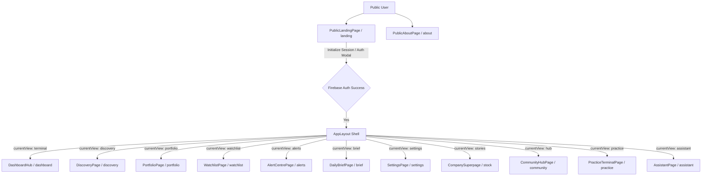

# Route Architecture Audit

This document details the route structure, views, and entry points of the StockStory India application.

## Active Routes & Component Mapping

| Route Query (`page=`) | Component Name | Purpose | Entry Point | Outbound Navigation | Current Status | Classification |
| :--- | :--- | :--- | :--- | :--- | :--- | :--- |
| `landing` (default) | `PublicLandingPage` | Public presentation and marketing hero landing. | Root url (`/`) | Auth Gateway / `/about` | Active | **KEEP** (Refactor to `/`) |
| `about` | `PublicAboutPage` | Explains StockStory's structural, noise-free philosophy. | Top Nav link | Auth Gateway / `/` | Active | **KEEP** (Redesign as core About) |
| `dashboard` | `DashboardHub` / `MarketIntelligenceDashboard` | Main dashboard displaying market indices, signals, and attention widgets. | Login redirect / Side rail | Stock detail page / Discovery | Active | **KEEP** (Set as default home) |
| `discovery` | `DiscoveryPage` | Grid lists of trending, quality, ownership, and value opportunities. | Side rail / Sidebar | Stock detail page (`?page=stock`) | Redesigned | **KEEP** |
| `stock` / `explore` | `CompanyUniversePage` / `CompanySuperpage` | Flagship equity intelligence detail analysis page. | Search / Cards / Watchlist | Sidebar / Navigation rail | Active | **REPLACE** (Rebuild as Master) |
| `portfolio` | `PortfolioPage` | Portfolio assets tracking, weights, and capital metrics. | Side rail / Sidebar | Stock detail page | Active | **KEEP** |
| `watchlist` | `WatchlistPage` | Watched companies tracking and quick change indices. | Side rail / Sidebar | Stock detail page | Active | **KEEP** |
| `alerts` | `AlertCentrePage` | Signal triggers, active alerts list, and threshold config. | Side rail / Sidebar | Stock detail page | Active | **KEEP** |
| `brief` | `DailyBriefPage` | Morning narrative digest of sector & factor swings. | Side rail / Sidebar | Stock detail page | Active | **MERGE** (Merge into Dashboard) |
| `settings` | `SettingsPage` | User preferences, credentials, and configuration. | Profile button / Sidebar | Sign out | Active | **KEEP** |
| `community` | `CommunityHubPage` | Post forums, factor ideas sharing space. | Navigation switcher | Stock detail page | Active | **REMOVE** |
| `practice` | `PracticeTerminalPage` | Paper-trading and mock buy/sell sandbox. | Navigation switcher | Dashboard | Active | **REMOVE** |
| `assistant` | `AssistantPage` | Conversational equity AI assistant panel. | Navigation rail | Stock detail page | Active | **REMOVE** |
| `healthometer_qa` | `HealthometerQAPage` | Diagnostic UI for health score distributions. | Direct URL | None | Active | **REMOVE** (Move to test scripts) |

---

## Visual Navigation Diagram (Current System)

