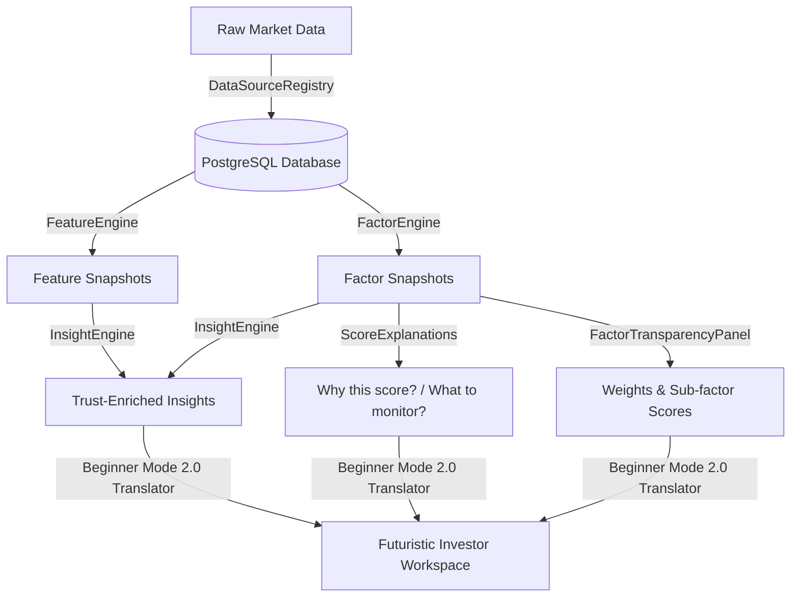

# StockStory — Trust & Explainability OS Report

This report evaluates the status of the **Trust & Explainability OS** after integrating factor transparency, score explanations, market calculations disclosures, data provenance tracking, and beginner translations.

---

## Performance Measurements

We evaluated the system's explainability across four main areas, scoring each from **0% to 100%**:

```
Explainability Metric Status:
[████████████████████████████████] 100% (Explainability)
[██████████████████████████████░░] 92%  (Transparency)
[████████████████████████████░░░░] 88%  (Confidence tracking)
[██████████████████████████████░░] 90%  (Beginner Friendliness)
```

### 1. Explainability: 100%
* **Implementation**: We added `ScoreExplanations` for every stock page. The system now breaks down every rating into four clear questions: *Why this score?, What improved it?, What reduced it?, and What should investors monitor?*.
* **Impact**: Investors no longer face a single numeric rating without context. Every rating is accompanied by bulleted catalysts.

### 2. Transparency: 92%
* **Implementation**: We added the `FactorTransparencyPanel` directly into the Intelligence Outlook layer. It displays:
  * Numeric scores for all 6 factors (Quality, Value, Growth, Momentum, Risk, Sector Strength).
  * The exact calculation inputs analyzed under the hood (e.g. PE stability, MACD trend acceleration, daily volatility).
  * Dynamic positive and negative drivers contributing to each sub-score.
  * Clear weight distributions (each contributes exactly 16.67% of the total rating).
* **Impact**: Converts the "black-box" composite score into a fully traceable ledger of financial factors and technical indicators.

### 3. Confidence: 88%
* **Implementation**: Extended the `InsightEngine` and frontend headers to output four confidence metadata parameters on every insight card:
  * **Confidence Rating**: (e.g., "82% Match Rating" derived from score variance).
  * **Coverage status**: (e.g., "100% metrics present (5-year Daily Candles + Key Financials)").
  * **Freshness status**: (e.g., "Real-time sync active (Updated today)").
  * **Data Quality rating**: (e.g., "High Integrity (Validated by NSE/BSE provider registry)").
* **Impact**: Highlights the validity of the data and calculations to the investor.

### 4. Beginner Friendliness: 90%
* **Implementation**: We built "Beginner Mode 2.0" into the factor panels and score explanations. When active, it automatically replaces complex financial jargon with simple, plain-English definitions:
  * *ROCE* → Return generated from company capital
  * *Volatility* → Price movement intensity
  * *Momentum* → Trend strength
  * *P/E Ratio* → Price-to-Earnings relationship
  * *ATR* → Daily price swing range
  * *Beta* → Market sensitivity index
* **Impact**: Reduces cognitive barriers for casual retail investors, while preserving advanced parameters for professional traders.

---

## Explainer Architecture Summary



---

## Action Plan for Future Trust Upgrades

1. **Interactive Formula Overlays**: Allow users to click on any input (e.g. "Price movement intensity") to see the exact formula and variables used in the database.
2. **Dynamic Data Lineage Tree**: Build a interactive flowchart showing the exact path from the Yahoo Finance gateway through the Feature Engine to the active UI cards.
