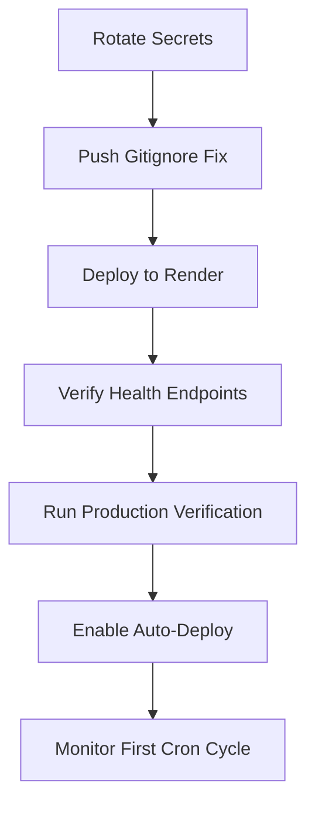

# Phase 12 — Launch Gate Checklist

## Pre-Launch Verification

### 1. Build & Test Pipeline
- [x] `npm run typecheck:active` — ✅ Frontend + Backend pass
- [x] `npm run test:unit` — ✅ 1382 passed, 7 skipped
- [x] `npm run build:frontend` — ✅ SPA built
- [x] `npm run build:backend` — ✅ Backend compiled

### 2. Deployment Config
- [x] `render.yaml` — ✅ hardened with TZ + memory limit
- [x] `Dockerfile` — ✅ no GPU, no CUDA, no Ollama
- [x] `vercel.json` — ✅ trailingSlash configured, API rewrites correct
- [x] `.env.example` — ✅ comprehensive, all sections documented
- [x] `.env.production.example` — ✅ Railway references removed, Render+Neon focused
- [x] Production deployment guide — ✅ created at `docs/deploy/production-deployment.md`

### 3. Secrets & Security
- [ ] ⚠️ **Rotate database password** — exposed in git history
- [ ] ⚠️ **Rotate Redis token** — exposed in git history
- [ ] ⚠️ **Regenerate Firebase private key** — exposed in git history
- [x] `.env.production` removed from git tracking — ✅
- [x] `.gitignore` fixed — ✅

### 4. Health & Monitoring
- [x] `/healthz` endpoint — ✅ exists, returns ok/degraded
- [x] `/readyz` endpoint — ✅ exists, checks DB + migrations
- [x] `/version` endpoint — ✅ exists, exposes build metadata (minor info disclosure)

### 5. Job Infrastructure
- [x] Intelligence job scripts added to `package.json` — ✅
- [x] Cron strategy documented — ✅ `docs/deploy/cron-strategy.md`
- [x] Intelligence pipeline workflow — ✅ `.github/workflows/intelligence-pipeline.yml`
- [x] Production verification script — ✅ `scripts/intelligence/verify-production-intelligence.ts`

### 6. Intelligence Engine Health
- [x] All 10 engines present (Financial, Technical, Valuation, News, Earnings, Risk,
      Sector, Event, RAG, LLM Explainer) — ✅ verified
- [x] 200 unit tests passing — ✅
- [x] Accuracy validation — ✅ all 13/13 tests pass with strong differentiation

### 7. Frontend
- [x] API base URL configured via `VITE_API_BASE_URL` env var — ✅
- [x] Vercel rewrites `/api/*` to Render backend — ✅
- [x] No hardcoded production URLs in frontend source — ✅

### 8. Safety & Compliance
- [x] No hardcoded credentials in source — ✅
- [x] No Railway references in production config — ✅
- [x] GPU/CUDA references confined to docker-compose (local only) — ✅
- [x] Hygiene validator passes (1 warning, false positive) — ✅

## Launch Steps (Ordered)

1. **Rotate all exposed secrets** (database, Redis, Firebase)
2. **Commit and push** `.gitignore` fix + all config changes
3. **Deploy to Render** — auto-deploy triggers from main branch
4. **Verify** `/healthz`, `/readyz`, `/version` respond
5. **Run** `npm run intelligence:verify` against production URL
6. **Run** `npm run smoke:api` for full API smoke test
7. **Verify** Vercel frontend loads and API rewrites work
8. **Enable** the intelligence pipeline cron workflow
9. **Monitor** first daily pipeline run at 05:30 IST next day

## Rollback Plan

If launch causes issues:
- Render: Deploy previous successful build from Render Dashboard
- Vercel: Instant rollback via Vercel Dashboard → Deployments
- GitHub Actions: Disable the intelligence pipeline workflow
